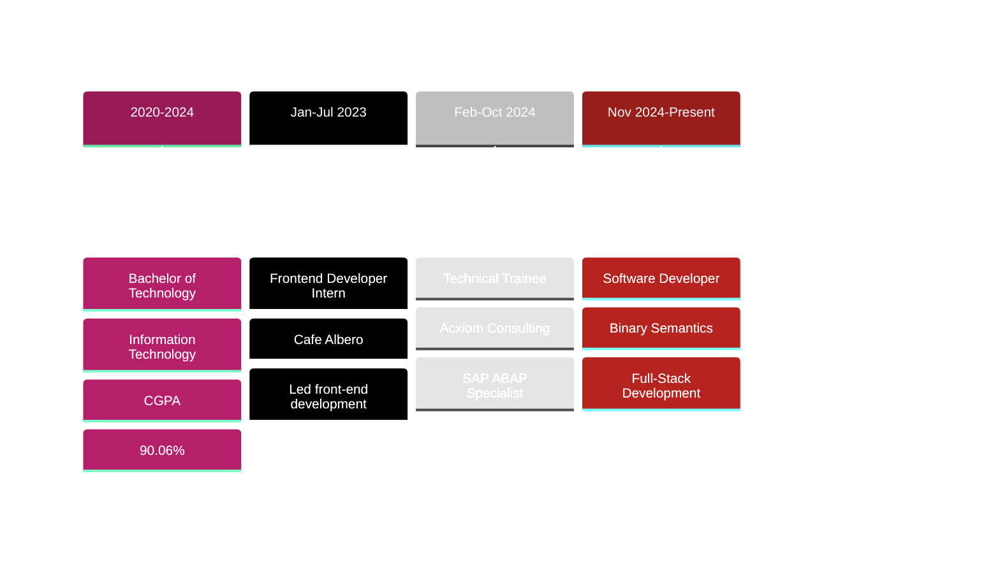

<!-- Header Typing Animation -->
<div align="center">
  <a href="https://git.io/typing-svg">
    
  </a>
</div>

<!-- Banner GIF -->
<p align="center">
  
</p>

<!-- Social Badges -->
<div align="center">
  <a href="https://www.linkedin.com/in/lakshya-grover" target="_blank">
    
  </a>
  <a href="mailto:groverlakshya.25.lg@gmail.com">
    
  </a>
  <a href="https://your-portfolio-link.com" target="_blank">
    
  </a>
  <a href="https://leetcode.com/your-leetcode-profile" target="_blank">
    
  </a>
  <a href="https://wa.me/your-whatsapp-number" target="_blank">
    
  </a>
</div>

<!-- Divider -->


<!-- About Me Section -->


###  About Me

```javascript
const lakshya = {
    role: "Full-Stack Developer",
    company: "Binary Semantics",
    location: "New Delhi, India 🇮🇳",
    code: ["JavaScript", "C#", "C++", "SAP ABAP"],
    technologies: {
        frontEnd: {
            js: ["React", "Node.js"],
            css: ["Bootstrap", "Tailwind", "Sass", "Material UI"]
        },
        backEnd: {
            dotnet: [".NET Core", "ASP.NET"],
            js: ["Express.js", "Node.js"]
        },
        databases: ["SQL Server", "MongoDB"],
        tools: ["Git", "VS Code", "SAP S/4 HANA"]
    },
    achievements: {
        performance: "⚡ Reduced query time by 40%",
        satisfaction: "🎯 95% client satisfaction",
        hackathon: "🏆 Top 12 in Live The Code"
    },
    currentFocus: "Building scalable enterprise solutions",
    funFact: "I debug code faster than I solve crosswords! 🎮"
};
```

<br clear="both">

<!-- Divider -->


##  Tech Stack & Tools

<p align="center">
  
  
  
  
  
  
  
  
</p>

<div align="center">

### Languages


### Frameworks & Libraries


### Databases & Tools


</div>

<!-- Divider -->


##  GitHub Stats & Activity

<p align="center">
  
</p>

<div align="center">
  
  
</div>

<p align="center">
  
</p>

<!-- Divider -->


##  Featured Projects

<div align="center">

<table>
<tr>
<td width="50%">
<h3 align="center">Library Management System 📚</h3>
<div align="center">
<a href="https://github.com/Lakshya-Grover/library-management-system" target="_blank">

</a>
<br><br>
<p>
<a href="https://github.com/Lakshya-Grover/library-management-system" target="_blank">

</a>
<a href="https://your-demo-link.com" target="_blank">

</a>
</p>
<p><strong>🛠️ MERN Stack • JWT Auth • MongoDB</strong></p>
<p>Full-featured library system with advanced search algorithms, reducing manual tracking by 90% and improving book discovery speed by 50%</p>
</div>
</td>

<td width="50%">
<h3 align="center">Travel World 🌍</h3>
<div align="center">
<a href="https://github.com/Lakshya-Grover/travel-world" target="_blank">

</a>
<br><br>
<p>
<a href="https://your-live-demo.com" target="_blank">

</a>
<a href="https://github.com/Lakshya-Grover/travel-world" target="_blank">

</a>
</p>
<p><strong>⚛️ React.js • Tailwind CSS • Router</strong></p>
<p>Responsive travel website with seamless navigation, achieving 70% increase in user engagement and 25% reduction in bounce rate</p>
</div>
</td>
</tr>
</table>

</div>

<!-- Divider -->


## 🏆 Achievements & Milestones

<p align="center">
  
</p>

<div align="center">

| 🎯 Achievement | 📊 Impact | 🏅 Recognition |
|:---:|:---:|:---:|
| **Performance Optimization** | ⚡ 40% faster queries, 25% lower API latency | Client Excellence Award |
| **Client Satisfaction** | 🌟 95% satisfaction score | Top Performer Q4 2024 |
| **Development Speed** | 🚀 20% faster delivery | Agile Champion |
| **Code Quality** | ✨ 30+ bugs fixed, 15% faster load time | Quality Star |
| **Hackathon Rank** | 🏆 Top 12/180 participants | Live The Code 2023 |

</div>

<!-- Divider -->


## 💼 Professional Journey



<!-- Divider -->


## 📈 Coding Activity

<div align="center">
  
</div>

<!-- WakaTime Stats - Uncomment after setting up WakaTime -->
<!-- <div align="center">
  
</div> -->

<!-- Divider -->


## 🤝 Let's Connect & Collaborate!

<p align="center">
  
</p>

<div align="center">

**💬 I'm always excited to discuss:**
- 🚀 Full-Stack Development & Architecture
- 💡 Performance Optimization Strategies
- 🔧 Enterprise Solutions & SAP Integration
- 🎨 UI/UX Best Practices
- 🤖 Emerging Technologies & AI Integration

</div>

<p align="center">
  <a href="mailto:groverlakshya.25.lg@gmail.com">
    
  </a>
  <a href="https://www.linkedin.com/in/lakshya-grover" target="_blank">
    
  </a>
  <a href="https://your-portfolio-link.com" target="_blank">
    
  </a>
</p>

<!-- Divider -->


<div align="center">

### 💭 Random Dev Quote


### 🐍 Contribution Snake

<picture>
  <source media="(prefers-color-scheme: dark)" srcset="https://raw.githubusercontent.com/Lakshya-Grover/Lakshya-Grover/output/github-contribution-grid-snake-dark.svg">
  <source media="(prefers-color-scheme: light)" srcset="https://raw.githubusercontent.com/Lakshya-Grover/Lakshya-Grover/output/github-contribution-grid-snake.svg">
  
</picture>

</div>

<!-- Footer -->


<p align="center">
  
</p>

<div align="center">
  
</div>

<div align="center">

### ⚡ "Code is like humor. When you have to explain it, it's bad." – Cory House

**Show some ❤️ by starring ⭐ some of the repositories!**

</div>
