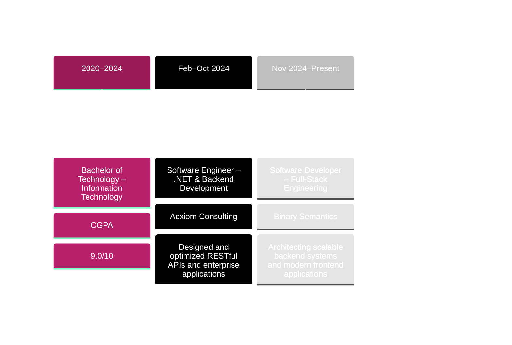

<!-- Header Typing Animation -->
<div align="center">
  <a href="https://git.io/typing-svg">
    
  </a>
</div>

<!-- Banner GIF -->
<p align="center">
  
</p>

<!-- Social Badges -->
<div align="center">
  <a href="https://linkedin.com/in/lakshya-grover" target="_blank">
    
  </a>
  <a href="https://github.com/AlienAlien369" target="_blank">
    
  </a>
  <a href="https://drive.google.com/file/d/1NeHoxEZWQiLNKWgsXFn26cD6CPNjv80l/view?usp=sharing" target="_blank">
    
  </a>
  <a href="mailto:groverlakshya.25.lg@gmail.com">
    
  </a>
  <a href="https://lakshya-grover.vercel.app" target="_blank">
    
  </a>
  <a href="https://leetcode.com/u/lakshya369/" target="_blank">
    
  </a>
  <a href="https://wa.link/ap98tt" target="_blank">
    
  </a>
</div>

<!-- Divider -->


<!-- About Me Section -->


###  About Me

```javascript
const lakshya = {
    role: "Full-Stack Engineer",
    company: "Binary Semantics",
    location: "Gurugram, Haryana",
    code: ["C#", "JavaScript", "TypeScript", "Python", "SQL"],
    technologies: {
        frontEnd: {
            js: ["React.js", "TypeScript"],
            css: ["Bootstrap", "Tailwind", "Sass", "Material UI"]
        },
        backEnd: {
            dotnet: ["ASP.NET Core", ".NET MVC", ".NET Web APIs"],
            js: ["Node.js", "Express.js"]
        },
        databases: ["SQL Server", "MongoDB", "PostgreSQL", "Redis"],
        security: ["JWT", "OAuth 2.0", "RBAC", "OWASP Standards"],
        tools: ["Git", "Azure DevOps", "Visual Studio", "VS Code", "Postman", "SSMS"]
    },
    achievements: {
        performance: "Reduced query execution time by 45% and API latency by 30%",
        reliability: "Contributed to 99.9% uptime with testing and CI workflows",
        hackathon: "Top 12 in Live The Code Hackathon"
    },
    currentFocus: "Building secure, scalable enterprise full-stack applications",
    funFact: "I enjoy solving performance bottlenecks in distributed systems."
};
```

<br clear="both">

<!-- Tech Stack Section -->
##  Tech Stack & Tools

<p align="center">
  
  
  
  
  
  
  
  
</p>

<div align="center">

### Languages


### Frameworks & Libraries


### Databases & Tools


</div>

<!-- Divider -->


##  GitHub Stats & Activity

<p align="center">
  
</p>

<p align="center">
  
</p>

<!-- Divider -->


##  Featured Projects

<div align="center">

<table>
<tr>
<td width="50%">
<h3 align="center">Library Management System</h3>
<div align="center">
<a href="https://github.com/AlienAlien369/Library-Management-System" target="_blank">

</a>
<br><br>
<p>
<a href="https://github.com/AlienAlien369/Library-Management-System" target="_blank">

</a>
<a href="https://library-management-system-lg.vercel.app/" target="_blank">

</a>
</p>
<p><strong>MERN Stack | JWT Auth | MongoDB</strong></p>
<p>Developed a full-stack MERN application managing 10,000+ book records with JWT authentication and role-level access control. Improved search efficiency by 50% using MongoDB aggregation pipelines.</p>
</div>
</td>

<td width="50%">
<h3 align="center">Capture Call - Enterprise Call Management System</h3>
<div align="center">
<a href="https://github.com/AlienAlien369" target="_blank">

</a>
<br><br>
<p>
<a href="https://connect-hq.vercel.app/" target="_blank">

</a>
<a href="https://github.com/AlienAlien369/Connect-Hq" target="_blank">

</a>
</p>
<p><strong>React.js | TypeScript | WebSockets | MongoDB</strong></p>
<p>Architected a full-stack MERN platform handling 500+ concurrent call sessions with WebSocket-based real-time updates. Achieved 99.8% event delivery reliability and reduced dashboard query response time by 35%.</p>
</div>
</td>
</tr>
</table>

</div>

<!-- Divider -->


## 🏆 Achievements & Milestones

<div align="center">

|        🎯 Achievement         |                       📊 Impact                       |      🏅 Recognition      |
| :--------------------------: | :--------------------------------------------------: | :---------------------: |
| **Performance Optimization** |  45% faster query execution, 30% lower API latency   |  Production Excellence  |
|    **System Reliability**    | 99.9% uptime with 80% test coverage and CI workflows |   Engineering Impact    |
|   **Secure Architecture**    |   JWT/OAuth2 + RBAC + rate limiting in production    | Security-First Delivery |
|  **Scalable Integrations**   |  1,000+ daily IoT events and 10+ internal services   |  Platform Reliability   |
|      **Hackathon Rank**      |               Top 12/180 participants                |   Live The Code 2023    |

</div>

<!-- Divider -->


## 💼 Work Experience




<!-- Divider -->


## 🤝 Let's Connect & Collaborate!

<p align="center">
  
</p>

<div align="center">

**💬 I'm always excited to discuss:**
- Full-Stack Development & Architecture
- Performance Optimization Strategies
- Secure Authentication, RBAC & API Architecture
- Real-Time Systems & WebSocket Integrations
- Emerging Technologies & AI Integration

</div>

<p align="center">
  <a href="mailto:groverlakshya.25.lg@gmail.com">
    
  </a>
  <a href="https://linkedin.com/in/lakshya-grover" target="_blank">
    
  </a>
  <a href="https://github.com/AlienAlien369" target="_blank">
    
  </a>
  <a href="https://drive.google.com/file/d/1NeHoxEZWQiLNKWgsXFn26cD6CPNjv80l/view?usp=sharing" target="_blank">
    
  </a>
  <a href="https://lakshya-grover.vercel.app" target="_blank">
    
  </a>
</p>

<!-- Divider -->


<div align="center">

### 💭 Random Dev Quote


### 🐍 Contribution Snake

<picture>
  <source media="(prefers-color-scheme: dark)" srcset="https://raw.githubusercontent.com/AlienAlien369/AlienAlien369/53fd202d4293b6e3bef146504c333906d9158fc3/github-contribution-grid-snake-dark.svg">
  <source media="(prefers-color-scheme: light)" srcset="https://github.com/AlienAlien369/AlienAlien369/blob/output/github-contribution-grid-snake.gif?raw=true">
  
</picture>

</div>

<!-- Footer -->


<p align="center">
  
</p>

<div align="center">
  
</div>

<div align="center">

### ⚡ "Code is like humor. When you have to explain it, it's bad." – Cory House

**Show some ❤️ by starring ⭐ some of the repositories!**

</div>

Last updated: Mon Mar  2 05:07:25 UTC 2026
Last updated: Tue Mar  3 05:06:20 UTC 2026
Last updated: Wed Mar  4 04:57:16 UTC 2026
Last updated: Thu Mar  5 05:04:19 UTC 2026
Last updated: Fri Mar  6 05:00:41 UTC 2026
Last updated: Sat Mar  7 04:45:14 UTC 2026
Last updated: Sun Mar  8 05:00:43 UTC 2026
Last updated: Mon Mar  9 05:11:59 UTC 2026
Last updated: Tue Mar 10 04:59:40 UTC 2026
Last updated: Wed Mar 11 05:01:22 UTC 2026
Last updated: Thu Mar 12 05:06:41 UTC 2026
Last updated: Fri Mar 13 05:04:36 UTC 2026
Last updated: Sat Mar 14 05:01:20 UTC 2026
Last updated: Sun Mar 15 05:43:20 UTC 2026
Last updated: Mon Mar 16 01:48:31 UTC 2026
Last updated: Tue Mar 17 01:25:51 UTC 2026
Last updated: Wed Mar 18 01:28:52 UTC 2026
Last updated: Thu Mar 19 01:29:12 UTC 2026
Last updated: Fri Mar 20 01:24:29 UTC 2026
Last updated: Sat Mar 21 01:20:05 UTC 2026
Last updated: Sun Mar 22 01:29:12 UTC 2026
Last updated: Mon Mar 23 01:28:59 UTC 2026
Last updated: Tue Mar 24 01:23:02 UTC 2026
Last updated: Wed Mar 25 01:27:35 UTC 2026
Last updated: Thu Mar 26 01:46:44 UTC 2026
Last updated: Fri Mar 27 01:46:59 UTC 2026
Last updated: Sat Mar 28 01:26:34 UTC 2026
Last updated: Sun Mar 29 01:49:16 UTC 2026
Last updated: Mon Mar 30 01:51:39 UTC 2026
Last updated: Tue Mar 31 01:47:59 UTC 2026
Last updated: Wed Apr  1 01:55:43 UTC 2026
Last updated: Thu Apr  2 01:44:40 UTC 2026
Last updated: Fri Apr  3 01:46:18 UTC 2026
Last updated: Sat Apr  4 01:27:42 UTC 2026
Last updated: Sun Apr  5 01:50:53 UTC 2026
Last updated: Mon Apr  6 01:51:59 UTC 2026
Last updated: Tue Apr  7 01:48:47 UTC 2026
Last updated: Wed Apr  8 01:49:14 UTC 2026
Last updated: Thu Apr  9 01:28:24 UTC 2026
Last updated: Fri Apr 10 01:53:06 UTC 2026
Last updated: Sat Apr 11 01:44:06 UTC 2026
Last updated: Sun Apr 12 01:55:31 UTC 2026
Last updated: Mon Apr 13 02:00:30 UTC 2026
Last updated: Tue Apr 14 01:55:01 UTC 2026
Last updated: Wed Apr 15 01:51:33 UTC 2026
Last updated: Thu Apr 16 01:59:52 UTC 2026
Last updated: Fri Apr 17 01:55:47 UTC 2026
Last updated: Sat Apr 18 01:47:05 UTC 2026
Last updated: Sun Apr 19 01:59:43 UTC 2026
Last updated: Mon Apr 20 02:00:51 UTC 2026
Last updated: Tue Apr 21 01:56:40 UTC 2026
Last updated: Wed Apr 22 01:54:58 UTC 2026
Last updated: Thu Apr 23 01:59:07 UTC 2026
Last updated: Fri Apr 24 01:59:22 UTC 2026
Last updated: Sat Apr 25 01:49:45 UTC 2026
Last updated: Sun Apr 26 02:02:44 UTC 2026
Last updated: Mon Apr 27 02:05:25 UTC 2026
Last updated: Tue Apr 28 02:11:41 UTC 2026
Last updated: Wed Apr 29 02:12:51 UTC 2026
Last updated: Thu Apr 30 02:13:01 UTC 2026
Last updated: Fri May  1 02:26:30 UTC 2026
Last updated: Sat May  2 02:03:43 UTC 2026
Last updated: Sun May  3 02:09:14 UTC 2026
Last updated: Mon May  4 02:08:20 UTC 2026
Last updated: Tue May  5 02:07:17 UTC 2026
Last updated: Wed May  6 02:07:50 UTC 2026
Last updated: Thu May  7 02:09:46 UTC 2026
Last updated: Fri May  8 02:26:16 UTC 2026
Last updated: Sat May  9 02:10:51 UTC 2026
Last updated: Sun May 10 02:12:32 UTC 2026
Last updated: Mon May 11 02:30:45 UTC 2026
Last updated: Tue May 12 02:24:18 UTC 2026
Last updated: Wed May 13 02:31:04 UTC 2026
Last updated: Thu May 14 02:32:27 UTC 2026
Last updated: Fri May 15 02:31:29 UTC 2026
Last updated: Sat May 16 02:13:27 UTC 2026
Last updated: Sun May 17 02:28:50 UTC 2026
Last updated: Mon May 18 02:38:57 UTC 2026
Last updated: Tue May 19 02:36:56 UTC 2026
Last updated: Wed May 20 02:37:32 UTC 2026
Last updated: Thu May 21 02:39:26 UTC 2026
Last updated: Fri May 22 02:40:54 UTC 2026
Last updated: Sat May 23 02:26:23 UTC 2026
Last updated: Sun May 24 02:36:04 UTC 2026
Last updated: Mon May 25 02:44:48 UTC 2026
Last updated: Tue May 26 02:33:39 UTC 2026
Last updated: Wed May 27 02:43:52 UTC 2026
Last updated: Thu May 28 02:30:36 UTC 2026
Last updated: Fri May 29 02:34:59 UTC 2026
Last updated: Sat May 30 02:29:05 UTC 2026
Last updated: Sun May 31 02:45:53 UTC 2026
Last updated: Mon Jun  1 02:54:33 UTC 2026
Last updated: Tue Jun  2 02:51:35 UTC 2026
Last updated: Wed Jun  3 03:26:15 UTC 2026
Last updated: Thu Jun  4 02:55:33 UTC 2026
Last updated: Fri Jun  5 02:43:33 UTC 2026
Last updated: Sat Jun  6 02:30:51 UTC 2026
Last updated: Sun Jun  7 02:49:52 UTC 2026
Last updated: Mon Jun  8 02:52:26 UTC 2026
Last updated: Tue Jun  9 02:29:45 UTC 2026
Last updated: Wed Jun 10 02:43:31 UTC 2026
Last updated: Thu Jun 11 02:52:49 UTC 2026
Last updated: Fri Jun 12 02:49:45 UTC 2026
Last updated: Sat Jun 13 02:42:16 UTC 2026
Last updated: Sun Jun 14 02:53:39 UTC 2026
Last updated: Mon Jun 15 02:58:44 UTC 2026
Last updated: Tue Jun 16 02:59:00 UTC 2026
Last updated: Wed Jun 17 02:56:18 UTC 2026
Last updated: Thu Jun 18 02:51:09 UTC 2026
Last updated: Fri Jun 19 03:37:07 UTC 2026
Last updated: Sat Jun 20 02:41:05 UTC 2026
Last updated: Sun Jun 21 02:57:29 UTC 2026
Last updated: Mon Jun 22 03:27:41 UTC 2026
Last updated: Tue Jun 23 02:35:08 UTC 2026
Last updated: Wed Jun 24 02:35:37 UTC 2026
Last updated: Thu Jun 25 02:37:14 UTC 2026
Last updated: Fri Jun 26 02:40:05 UTC 2026
Last updated: Sat Jun 27 02:32:25 UTC 2026
Last updated: Sun Jun 28 02:45:19 UTC 2026
