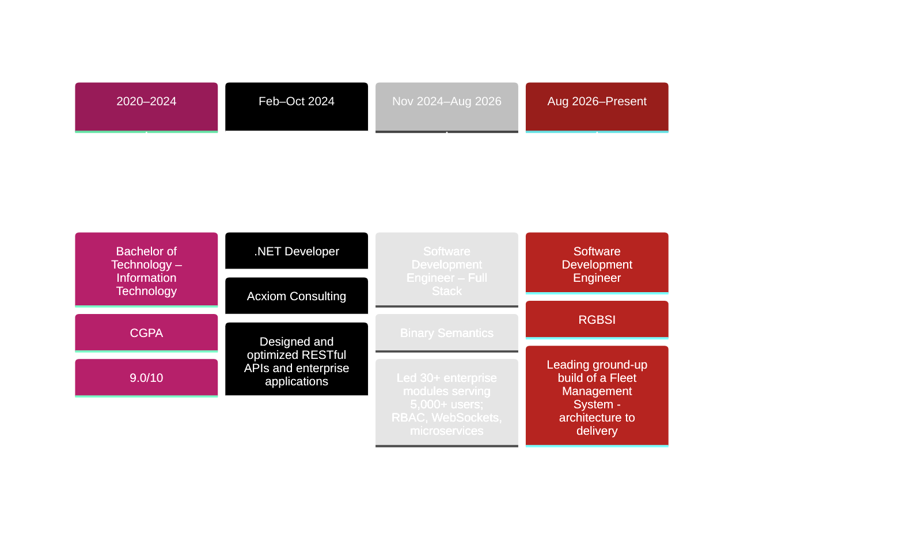

<!-- Header Typing Animation -->
<div align="center">
  <a href="https://git.io/typing-svg">
    
  </a>
</div>

<!-- Banner GIF -->
<p align="center">
  
</p>

<!-- Social Badges -->
<div align="center">
  <a href="https://linkedin.com/in/lakshya-grover" target="_blank">
    
  </a>
  <a href="https://github.com/AlienAlien369" target="_blank">
    
  </a>
  <a href="https://drive.google.com/file/d/12efVsLpcvdh230GukLa1RtsvB9reeus8/view?usp=sharing" target="_blank">
    
  </a>
  <a href="mailto:groverlakshya.25.lg@gmail.com">
    
  </a>
  <a href="https://lakshya-grover.vercel.app" target="_blank">
    
  </a>
  <a href="https://leetcode.com/u/lakshya369/" target="_blank">
    
  </a>
  <a href="https://wa.link/ap98tt" target="_blank">
    
  </a>
</div>

<!-- Divider -->


<!-- About Me Section -->


###  About Me

```javascript
const lakshya = {
    role: "Software Development Engineer",
    company: "RGBSI",
    location: "Gurugram, Haryana",
    experience: "3+ years",
    code: ["C#", "JavaScript", "TypeScript", "Python", "SQL"],
    technologies: {
        frontEnd: {
            js: ["React.js 18", "TypeScript"],
            css: ["Bootstrap", "Tailwind", "Sass", "Material UI"]
        },
        backEnd: {
            dotnet: ["ASP.NET Core (.NET 7/8)", ".NET MVC", ".NET Web APIs"],
            js: ["Node.js", "Express.js"],
            python: ["FastAPI"]
        },
        genAI: ["LangChain", "ChromaDB", "OpenAI GPT-4o", "RAG Pipelines", "Vector Databases", "Prompt Engineering"],
        databases: ["SQL Server", "MongoDB", "PostgreSQL", "Redis"],
        messaging: ["MQTT", "WebSockets", "REST APIs"],
        security: ["JWT", "OAuth 2.0", "RBAC", "OWASP Standards"],
        tools: ["Git", "Azure DevOps", "Docker", "Visual Studio", "VS Code", "Postman", "SSMS"]
    },
    achievements: {
        ownership: "Leading ground-up build of a Fleet Management System - architecture to delivery",
        performance: "Reduced query execution time by 45% and API latency by 30%",
        reliability: "Contributed to 99.9% uptime with testing and CI workflows",
        hackathon: "Top 12 among 180+ in Live The Code Hackathon"
    },
    currentFocus: "Architecting a Fleet Management System end-to-end, and building RAG pipelines with LangChain + ChromaDB + GPT-4o",
    funFact: "I enjoy solving performance bottlenecks in distributed systems."
};
```

<br clear="both">

<!-- Tech Stack Section -->
##  Tech Stack & Tools

<p align="center">
  
  
  
  
  
  
  
  
</p>

<div align="center">

### Languages


### Frameworks & Libraries


### AI & GenAI


### Databases & Tools


</div>

<!-- Divider -->


##  GitHub Stats & Activity

<p align="center">
  
</p>

<p align="center">
  
</p>

<!-- Divider -->


##  Featured Projects

<div align="center">

<table>
<tr>
<td width="50%">
<h3 align="center">Library Management System</h3>
<div align="center">
<a href="https://github.com/AlienAlien369/Library-Management-System" target="_blank">

</a>
<br><br>
<p>
<a href="https://github.com/AlienAlien369/Library-Management-System" target="_blank">

</a>
<a href="https://library-management-system-lg.vercel.app/" target="_blank">

</a>
</p>
<p><strong>MERN Stack | JWT Auth | MongoDB</strong></p>
<p>Developed a full-stack MERN application managing 10,000+ book records with JWT authentication and role-level access control. Improved search efficiency by 50% using MongoDB aggregation pipelines.</p>
</div>
</td>

<td width="50%">
<h3 align="center">Capture Call - Enterprise Call Management System</h3>
<div align="center">
<a href="https://github.com/AlienAlien369" target="_blank">

</a>
<br><br>
<p>
<a href="https://connect-hq.vercel.app/" target="_blank">

</a>
<a href="https://github.com/AlienAlien369/Connect-Hq" target="_blank">

</a>
</p>
<p><strong>React.js | TypeScript | WebSockets | MongoDB</strong></p>
<p>Architected a full-stack MERN platform handling 500+ concurrent call sessions with WebSocket-based real-time updates. Achieved 99.8% event delivery reliability and reduced dashboard query response time by 35%.</p>
</div>
</td>
</tr>
<tr>
<td width="50%">
<h3 align="center">RAG Document Intelligence System</h3>
<div align="center">
<p>
<strong>Python | LangChain | ChromaDB | OpenAI GPT-4o | FastAPI | Docker</strong>
</p>
<p>Built an end-to-end Retrieval-Augmented Generation pipeline for semantic document search and context-aware Q&A over private knowledge bases. Indexed 10,000+ document chunks in ChromaDB using OpenAI text-embedding-3-small, orchestrated multi-step retrieval/generation chains with LangChain, and exposed the pipeline via async FastAPI endpoints — improving retrieval precision by 40% over baseline keyword search.</p>
</div>
</td>

<td width="50%">
<h3 align="center">Fleet Management System</h3>
<div align="center">
<p>
<strong>ASP.NET Core | React.js | PostgreSQL | Microservices</strong>
</p>
<p>Leading the ground-up build of an enterprise fleet management platform at RGBSI — owning database schema design, frontend architecture, backend APIs, and authentication from initial setup through production-ready delivery.</p>
</div>
</td>
</tr>
</table>

</div>

<!-- Divider -->


## 🏆 Achievements & Milestones

<div align="center">

|        🎯 Achievement         |                       📊 Impact                       |      🏅 Recognition      |
| :--------------------------: | :--------------------------------------------------: | :---------------------: |
|   **Product Ownership**      |  Leading ground-up build of a Fleet Management System |  End-to-End Delivery   |
|      **GenAI / RAG**         | Built RAG pipeline indexing 10K+ chunks, +40% retrieval precision | LangChain + ChromaDB + GPT-4o |
| **Performance Optimization** |  45% faster query execution, 30% lower API latency   |  Production Excellence  |
|    **System Reliability**    | 99.9% uptime with 80% test coverage and CI workflows |   Engineering Impact    |
|   **Secure Architecture**    |   JWT/OAuth2 + RBAC + rate limiting in production    | Security-First Delivery |
|  **Scalable Integrations**   |  1,000+ daily IoT events and 10+ internal services   |  Platform Reliability   |
|      **Hackathon Rank**      |               Top 12/180 participants                |   Live The Code 2023    |

</div>

<!-- Divider -->


## 💼 Work Experience




<!-- Divider -->


## 🤝 Let's Connect & Collaborate!

<p align="center">
  
</p>

<div align="center">

**💬 I'm always excited to discuss:**
- Full-Stack Development & Architecture
- Generative AI, RAG Pipelines & LLM Integration
- Performance Optimization Strategies
- Secure Authentication, RBAC & API Architecture
- Real-Time Systems & WebSocket Integrations

</div>

<p align="center">
  <a href="mailto:groverlakshya.25.lg@gmail.com">
    
  </a>
  <a href="https://linkedin.com/in/lakshya-grover" target="_blank">
    
  </a>
  <a href="https://github.com/AlienAlien369" target="_blank">
    
  </a>
  <a href="https://drive.google.com/file/d/1NeHoxEZWQiLNKWgsXFn26cD6CPNjv80l/view?usp=sharing" target="_blank">
    
  </a>
  <a href="https://lakshya-grover.vercel.app" target="_blank">
    
  </a>
</p>

<!-- Divider -->


<div align="center">

### 💭 Random Dev Quote


### 🐍 Contribution Snake

<picture>
  <source media="(prefers-color-scheme: dark)" srcset="https://raw.githubusercontent.com/AlienAlien369/AlienAlien369/output/github-contribution-grid-snake-dark.svg">
  <source media="(prefers-color-scheme: light)" srcset="https://raw.githubusercontent.com/AlienAlien369/AlienAlien369/output/github-contribution-grid-snake.gif">
  
</picture>

</div>

<!-- Footer -->


<p align="center">
  
</p>

<div align="center">
  
</div>

<div align="center">

### ⚡ "Code is like humor. When you have to explain it, it's bad." – Cory House

**Show some ❤️ by starring ⭐ some of the repositories!**

</div>

Last updated: Mon Sep 21 02:40:21 UTC 2026
